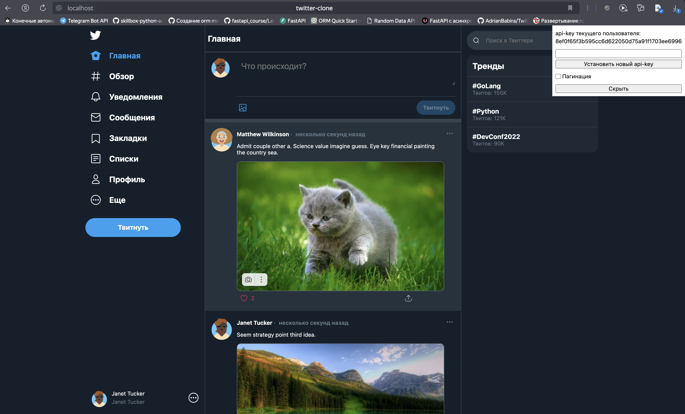
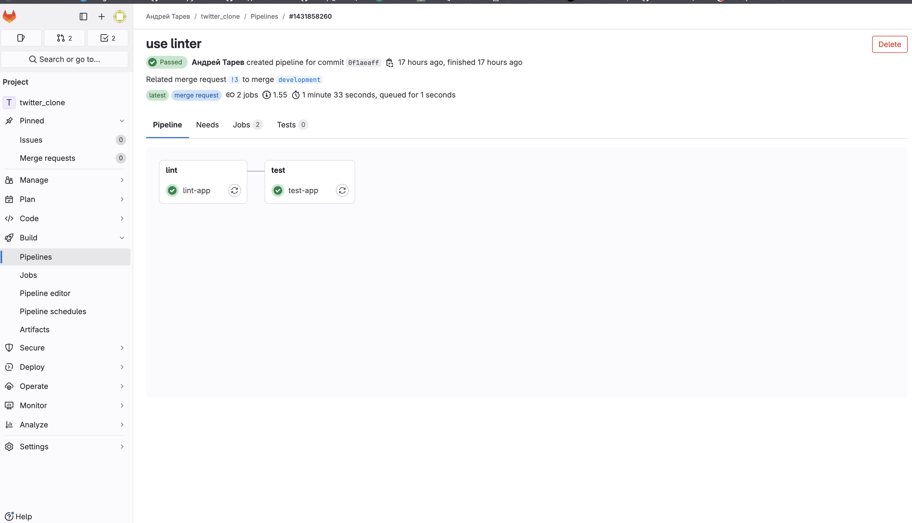
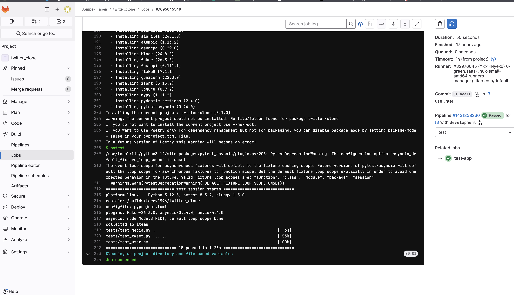

# Twitter_clone | FastAPI

API для корпоративного сервиса микроблогов, который умеет отправлять твиты(можно вкладывать картинки), удалять их, 
ставить лайки. Так же можно подписываться/отписываться на автора блога. Приложение можно развернуть двумя способами
с помощью docker-compose и в kubernetes кластере. Приложение полностью прошло проверку линтерами - flake8, black, isort, 
mypy. А также протестировано с помощью автотестов написанных на pytest.


## Используемые технологии

- **FastAPI** - Для быстрых запросов с использованием асинхронности
- **PostgreSQL** - Для удобного хранения данных.
- **Nginx** - Для быстрой раздачи статики, а также многопользовательской поддержки сайта
- **Alembic** - Для версионирования БД, с сохранением данных в базе
- **SQLAlchemy(Asyncpg)** - Для создания моделей (Python Class) и запросов к бд
- **Gitlab CI** - Для автоматического линтинга и тестирования приложения
- **Pytest** - Для тестов приложения
- **Docker** - Контейнеризация приложений
- **Kubernetes(helm)** - Развертывание приложения


## Структура backend приложения

```
backend
├── Dockerfile
└── src
    ├── api
    │   ├── api_v1
    │   │   ├── cruds
    │   │   │   ├── media_crud.py
    │   │   │   ├── tweets_crud.py
    │   │   │   └── user_crud.py
    │   │   └── routers
    │   │       ├── media_route.py
    │   │       ├── tweets_route.py
    │   │       └── users_route.py
    │   └── dependencies
    │       └── user.py
    ├── core
    │   ├── base.py
    │   ├── config.py
    │   ├── db_helper.py
    │   ├── models
    │   │   ├── followers.py
    │   │   ├── likes.py
    │   │   ├── medias.py
    │   │   ├── mixins
    │   │   │   └── id_int_pk.py
    │   │   ├── security_key.py
    │   │   ├── tweets.py
    │   │   └── users.py
    │   └── schemas
    │       ├── error_schemas.py
    │       ├── likes_schema.py
    │       ├── media_schemas.py
    │       ├── tweets_schema.py
    │       └── users_schema.py
    ├── main.py
    └── utils
        ├── faker_db.py
        └── logging_config.py
```


#### api/api_v1/cruds

- **media_crud** - логика по работе с загрузкой медиа
- **tweets_crud** - логика по работе с твитами
- **user_crud** - логика по работе с пользователями

#### api/api_v1/routers

- **medias** - эндпоинты по работе с загрузкой изображений
- **tweets** - эндпоинты по работы с твитами (создание, удаление, т.д)
- **users** - эндпоинты по работе со пользвоателями (получение информации, т.д)


#### Other files

- **config** - Конфигурационные настройки, например определение URL
- **db_helper** - найстройки самого подключения, определение session, engine
- **models** - ORM модели
- **schemas** - схемы pydantic для валидации данных
- **tests** - тесты приложения
- **faker_db.py** - создание фейковых данных для демонстрации
- **main** - Основной файл для запуска приложения
- **dependencies** - зависимости Fastapi для эндпоинтов
- **alembic** - папка с системными файлами alembic, а также сами файлы миграций
- **static** - папка с статическими файлы, такими как css, js, images и т.д
- **charts** - helm charts


## Установка приложения

1. Запуск с помощью docker-compose
   - Создать .env файл на основе шаблона .env.template
   - `docker compose up --build` - Запуск контейнеров Postgres, Api - приложения


2. Запуск в minikube
   - Сначала подготовим миникуб
      - minikube start --nodes=2 --cpus=4 --memory=7838 --cni=calico
      - minikube addons enable ingress
   - Создайте и загрузите образы в Docker register
      - docker build -t app:v1.0 .
      - docker build -t my-nginx:v1.0 ./frontend
      - minikube image load my-nginx:v1.0
      - minikube image load app:v1.0
      - helm upgrade --install fastapi charts/fastapi --version 1.0.0
      - Если используете миникуб в докере, то в отдельной консоли запустите туннель и держите открытым:
        - minikube tunnel (Не забудьте ввести системный пароль!)
      

Приложение будет доступно по адресу: http://localhost/

Документация в swagger доступна по пути: http://localhost/docs

## Example




